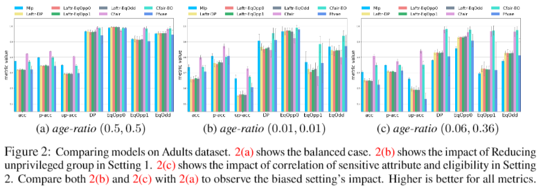
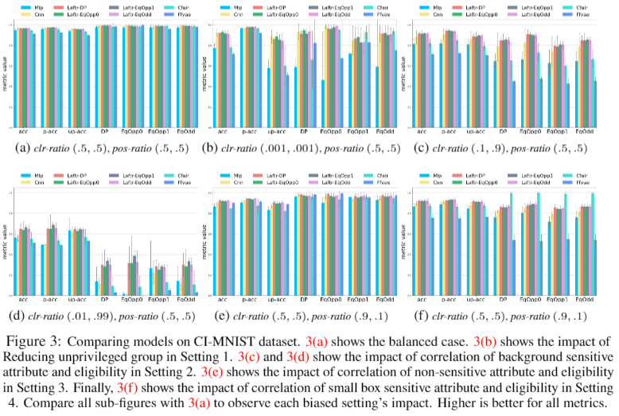

# Codebase for Benchmarking Bias Mitigation Algorithms in Representation Learning through Fairness Metrics.

This repository is the official implementation of [Benchmarking Bias Mitigation Algorithms in Representation Learning through Fairness Metrics][benchmarking]

As increasingly more attention and importance is given to algorithmic fairness by machine learning researchers and practitioners, with new models being proposed to make predictions more 'fair', there
is a void of a common framework to analyze and compare their capabilities. In this work, we evaluate different fairness methods trained with deep neural networks on a common synthetic dataset and a real-world dataset to aid and obtain insight into the behaviour of methods that seek to improve the fairness of predictions by deep learning models. Overall, we present a dataset, propose various biased evaluation setups, and rigorously evaluate recently proposed debiasing algorithms in a common framework.

## Quickstart

A code snippet that demonstrastes how to quickly benchmark a particlar technique on our synthetic dataset:
```
python train/execute.py --arch "mlp/conv/laftr-dp/laftr-eqodd/laftr-eqopp0/laftr-eqopp1/ffvae/cfair/cfair-eo" --ifwandb
```

## What are the datasets and associated tasks?

* CI-MNIST dataset: A variant of [MNIST][mnist], where we introduce different types of correlations between dataset features and eligibility criterion.
* Adult dataset: Original [Adult][adult] dataset with a new sensitive dataset feature correlated with eligibility criterion.

## Which models have been implemented and tested?

* [LAFTR][laftr][5] - Laftr-DP, Laftr-EqOpp0, Laftr-EqOpp1, Laftr-EqOdd variants
* [CFAIR][cfair][6] - Cfair, Cfair-EO variants
* [FFVAE][ffvae][7]
* MLP
* CNN

## How do we measure fairness?
We calculate several fairness metrics that are established in the fairness literature and have all been listed [here][metrics], but due to time and space constraints we restrict ourselves to the ones listed below. Note that there is neither a universal fairness metric nor a universally accepted definition of fairness.


## Setup
```bash
python3 -m venv fair_benchmark
source fair_benchmark/bin/activate
pip install -r requirements.txt
export PYTHONPATH=`pwd`$PYTHONPATH
```

### Reproducing paper experiments

Make sure that the adult and mnist datasets are in the ./data/ folder

For CI-MNIST dataset:
```bash
python dataloaders/mnist_loader.py --data_dir ./data
```

For Adult dataset:
Upload data files from the [Adult website][adult] to ./data/ folder

Once downloaded you can run CI-MNIST experiments like:
```bash
python scripts/coloredmnist/setting12/cfair_multiple_launcher.py
```

Once installed you can run ADULT experiments like:
```bash
python scripts/adult/setting12/cfair_multiple_launcher.py
```

As well as all the other scripts under scripts/adult or scripts/coloredmnist in order to complete the sweep of experiments that were completed for the results in the paper

For reproducing results in Setting 1, 2 of CI-MNIST:
Run the files in scripts/coloredmnist/setting12/ folder.

For reproducing results in Setting 3, 4 of CI-MNIST: 
Run the files in scripts/coloredmnist/setting34/ folder. 

For reproducing results in Setting 1, 2 of Adult:
Run the files in scripts/adult/setting12/ folder.

For reproducing ablation experiments in Tables 54 to 59 in the paper:
Run the files in scripts/ablations folder.

NOTE: Please remember to change the output directory argument (odir) from /scratch/charanr/fairness-project/

### Generating plots and tables
Initially generate the csvs of the experiments ran from wandb

Then parse the csvs, adds processed csvs to processed_csvs/ folder
```
python plots_tables/csvs/parse_csv.py
```

To create plots in paper, run files in plots_tables, example
```
python plots_tables/plots/barplots_adult.py
python plots_tables/plots/barplots_mnist.py
python plots_tables/plots/heatmap_std_adult.py
python plots_tables/plots/heatmap_std_mnist.py
python plots_tables/plots/heatmap_corr.py
```

To generate tables in the paper, run
```
python plots_tables/tables/get_tables.py
```

## Giving Credit

### Dataset Credits
CI-MNIST: This data is an extension of the publicly available MNIST dataset [1], which does not contain any personal data. Yann LeCun and Corinna Cortes hold the copyright of MNIST dataset, which is a derivative work from original NIST datasets. MNIST dataset is made available under the terms of the Creative Commons Attribution-Share Alike 3.0 license (CC BY-SA 3.0).

Adult: The Adult dataset was originally extracted by Barry Becker from the 1994 Census bureau databmaiN and the data was first cited in [3]. It was donated by Ronny Kohavi and Barry Becker (Data Mining and Visualization, Silicon Graphics) and publicly released to the community on the UCI Data Repository[2]. It is licensed under Creative Commons Public Domain (CC0). 

### Model Credits

LAFTR [5]: Model code is a PyTorch adapted version of [tensorflow LAFTR repository][laftrcode] 

CFAIR [6]: Model code is taken from [CFAIR repository][cfaircode]

We would like to especially thank [Elliot Creager][elliot] for helping us in building LAFTR [5], FFVAE [7] models

### Metric Credits

We have taken code for metrics from [fairness comparisons repository][friedlercode][8]

## Citations

To cite this repo:
```
@misc{fairdeeplearning,
  author = {Reddy, Charan and Sharma, Deepak and Mehri, Soroush and Romero-Soriano, Adriana and Shabanian, Samira and Honari, Sina},
  title = {Benchmarking Bias Mitigation Algorithms in Representation Learning through Fairness Metrics},
  year = {2021},
  publisher = {GitHub},
  journal = {GitHub Repository},
  howpublished = {\url{https://github.com/charan223/FairDeepLearning}},
}
```
If you cite this work, you may also want to cite:

1. [Yann LeCun and Corinna Cortes. MNIST handwritten digit database.ATT Labs [Online].Available: http://yann.lecun.com/exdb/mnist, 2010][mnist]
2. [Dua, D. and Graff, C. (2019). UCI Machine Learning Repository, Irvine, CA: University of California, School of Information and Computer Science][uci]
3. [Ron Kohavi, “Scaling Up the Accuracy of Naive-Bayes Classifiers: a Decision-Tree Hybrid”, Proceedings of the Second International Conference on Knowledge Discovery and Data Mining, 1996][adultpaper]
4. [Y. Lecun, L. Bottou, Y. Bengio and P. Haffner, "Gradient-based learning applied to document recognition," in Proceedings of the IEEE, vol. 86, no. 11, pp. 2278-2324, Nov. 1998][mnistpaper]
5. [David Madras, Elliot Creager, Toniann Pitassi, and Richard S. Zemel. Learning adversarially fair and transferable representations. InProceedings of the 35th International Conference on411Machine Learning, ICML, pages 3381–3390, 2018][laftr]
6. [Han Zhao, Amanda Coston, Tameem Adel, and Geoffrey J. Gordon. Conditional learning of fair representations. In International Conference on Learning Representations, 2020.][cfair]
7. [Elliot Creager, David Madras, Jörn-Henrik Jacobsen, Marissa A Weis, Kevin Swersky, Toniann Pitassi, and Richard Zemel. Flexibly fair representation learning by disentanglement. In International conference on machine learning, volume 97 of Proceedings of Machine Learning Research, pages 1436–1445. PMLR, 2019][ffvae]
8. [Sorelle A Friedler, Carlos Scheidegger, Suresh Venkatasubramanian, Sonam Choudhary, Evan P Hamilton, and Derek Roth. A comparative study of fairness-enhancing interventions in machine learning. In Proceedings of the Conference on Fairness, Accountability, and Transparency,pages 329–338. ACM, 2019][friedler]


## Results




[benchmarking]: https://openreview.net/forum?id=OTnqQUEwPKu
[mnist]: http://yann.lecun.com/exdb/mnist/
[mnistpaper]: https://doi.org/10.1109/5.726791
[adult]: http://archive.ics.uci.edu/ml/datasets/Adult
[uci]: http://archive.ics.uci.edu/ml
[adultpaper]: http://robotics.stanford.edu/~ronnyk/nbtree.pdf
[laftr]: http://proceedings.mlr.press/v80/madras18a.html
[cfair]: https://openreview.net/pdf?id=Hkekl0NFPr
[ffvae]: http://proceedings.mlr.press/v97/creager19a.html
[laftrcode]: https://github.com/VectorInstitute/laftr
[cfaircode]: https://github.com/hanzhaoml/ICLR2020-CFair
[elliot]: https://www.cs.toronto.edu/~creager/
[metrics]: https://github.com/charan223/FairDeepLearning/tree/main/metrics
[friedler]: https://arxiv.org/abs/1802.04422
[friedlercode]: https://github.com/algofairness/fairness-comparison
